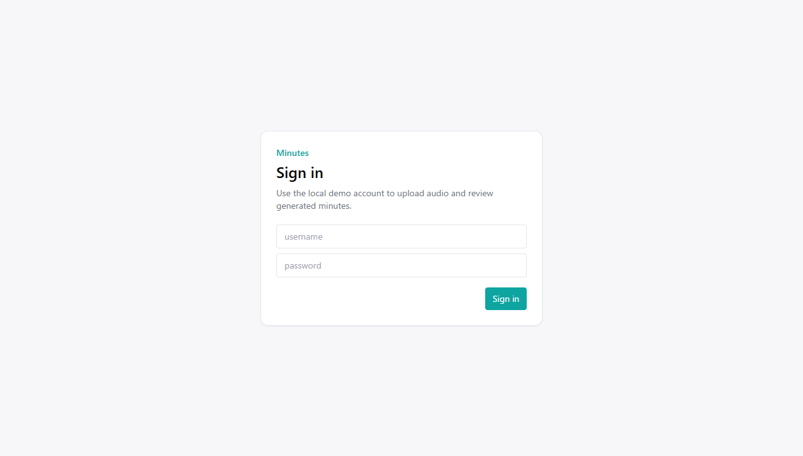
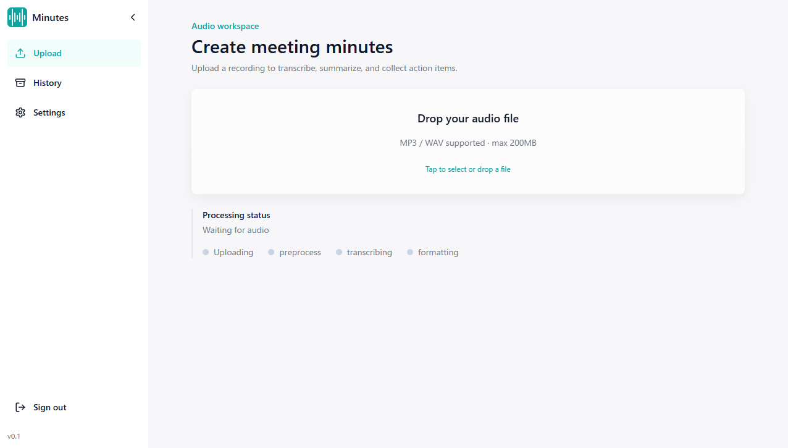
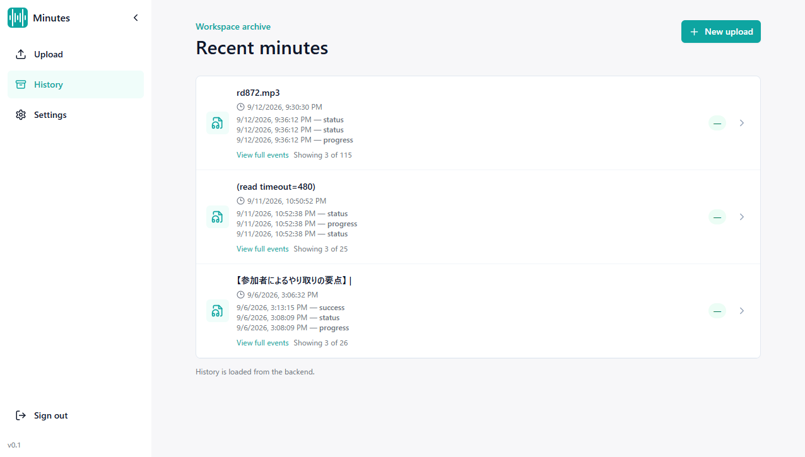

# Minutes

会議の録音をアップロードすると、文字起こし・要約・アクションアイテム付きの議事録まで進むローカル Web アプリです。Celery worker が処理し、ブラウザは SSE（切断時は polling）で進捗を見ます。

短い録音をアップロードすると、文字起こし・要約・アクションアイテムが得られます。標準の Docker Compose 構成がデモです。FastAPI、CPU 版 Whisper worker、PostgreSQL、Redis、nginx フロントエンドが入ります。





```text
ブラウザ  →  nginx (/ と /api)
                →  FastAPI
                      →  Redis / Celery
                            →  worker（faster-whisper、任意で Ollama）
```

## クイックスタート

ホストに Ollama がすでにある場合はこのままで構いません。Compose に Ollama も載せる場合は、下の「任意: Ollama」を参照してください。

```bash
git clone https://github.com/plaodas/minutes.git
cd minutes
docker compose up --build -d
python3 scripts/smoke_compose.py
```

<http://localhost> または <http://localhost:8080> を開いてログインします。

```text
username: demo
password: demo
```

[`docs/sample/demo-meeting.wav`](docs/sample/demo-meeting.wav) をアップロードしてください。デモ用の短い合成日本語音声で、実会議の録音ではありません。

初回タスクは Whisper モデルのダウンロードがあり、数分かかることがあります。進捗は `docker compose logs -f worker` で確認できます。`llm` プロファイルなしでは整形が `[FALLBACK]` のローカル要約で終わります。

## デモでできること

- MP3 / WAV のアップロード
- バックグラウンド処理: 前処理 → 文字起こし → 整形
- SSE での進捗表示（イベントストリームが遮断された場合は status polling）
- 文字起こし・要約・アクションアイテムとダウンロード
- 履歴、名前変更、削除、キャンセル
- Cookie セッションログイン（`demo` / `demo`）

管理画面、バケット画面、サービストークン画面はポートフォリオデモの対象外です。必要なときだけ `VITE_SHOW_ADMIN_CONTROLS=true` で再ビルドしてください。

## Compose サービス

- `frontend`: React SPA と FastAPI へのリバースプロキシ
- `minutes`: FastAPI（ホストには公開しない）
- `worker`: Celery と CPU 版 faster-whisper
- `db`, `redis`
- `migrate`, `bootstrap`: Alembic とデモユーザー作成

成果物は `data/outputs/`、アップロードは `data/uploads/` に置きます。MinIO、GPU、別立ての推論サービスは標準構成には含まれません。

必要環境は Docker Engine 24 以降、Compose v2、初回 Whisper ダウンロード用のネットワーク、CPU 文字起こしでおおよそ 8 GB RAM です。

ログインが `http://localhost/api/auth/login` に POST して `ERR_CONNECTION_REFUSED` になる場合、古い Service Worker がキャッシュ済み SPA を返していることがあります。DevTools → Application で登録を解除して再読み込みしてください。

### `.env`

`docker compose` は `.env` を `docker-compose.yml` の `${VAR}` 展開にだけ使います。`env_file:` はありません。値を変えたいときは `.env.example` をコピーしてください。

| キー | 用途 |
| --- | --- |
| `POSTGRES_USER`, `POSTGRES_PASSWORD`, `POSTGRES_DB` | PostgreSQL とコンテナ内 `DATABASE_URL` |
| `JWT_SECRET` | セッション署名 |
| `ADMIN_USER`, `ADMIN_PASS` | bootstrap が作るデモユーザー |
| `FRONTEND_PORT` | 追加のホストポート（既定 `8080`。80 番は常に公開） |
| `TRANSCRIBE_MODEL_SIZE` | worker の Whisper モデル |
| `OLLAMA_MODEL`, `OLLAMA_FALLBACK_MODELS`, `OLLAMA_TIMEOUT` | `--profile llm` のときだけ |

`.env` にある `MINIO_*`、`ADMIN_API_TOKEN`、`DATABASE_URL` はこの Compose では無視されます。ホスト側の Python から DB に繋ぐときは `localhost`、コンテナ同士は `db` です。サンプルの秘密情報は localhost 以外で使わないでください。

### 任意: Ollama

```bash
docker compose --profile llm up --build -d
docker compose logs -f ollama-pull
```

既定モデルは `qwen2.5:3b` です。モデルは `ollama_data` ボリュームに残ります。

### 停止

```bash
docker compose down
docker compose --profile llm down -v   # 名前付きボリュームも削除
```

## スモークテスト

`scripts/smoke_compose.py` は必須コンテナ、Alembic、Redis、`/api/health`、フロントエンド URL（既定 `http://localhost:8080`）経由のデモログインを確認します。

```bash
MINUTES_DEMO_URL=http://localhost:8081 \
ADMIN_USER=my-user \
ADMIN_PASS=my-password \
python3 scripts/smoke_compose.py
```

## ローカル開発

```bash
python -m venv .venv
source .venv/bin/activate
pip install -r requirements-api.txt -r requirements-worker.txt -r requirements-dev.txt
pip install -e .
export DATABASE_URL=sqlite:///./.pytest_sqlite.db
uvicorn backend.app:app --reload --port 8000

minutes-cli run docs/sample/demo-meeting.wav
```

```bash
cd frontend
npm ci
npm run dev
```

Vite は `/api` を `localhost:8000` にプロキシするので、ブラウザは同一オリジンのままです。`minutes/api.py` の CORS は FastAPI に直接つなぐ場合（プロキシなしの `http://localhost:5173` など）向けです。Compose の nginx では `:8080` 用の追加 CORS は不要です。

## テスト

```bash
export DATABASE_URL=sqlite:///./.pytest_sqlite.db
pytest -q

cd frontend
npm ci
npm run test:unit
npm run lint
npm run build
```

## 構成

```text
minutes/          FastAPI の構成ルート、ルーター、パイプライン、タスク領域
frontend/src/     API クライアント、SSE プロバイダ、hooks、UI
alembic/          PostgreSQL マイグレーション
docs/openapi.json 生成した OpenAPI スキーマ
docs/sample/      デモ音声
scripts/          bootstrap、スキーマ出力、スモークテスト
tests/            バックエンドテスト
```

```bash
cd frontend
npm run generate:api-types
```

この MVP は単一 Docker ホスト向けです。Redis outbox、GPU、OAuth、TLS、本番 MinIO、厳密なマルチ worker イベント配送は対象外です。

## ライセンス

`LICENSE` を参照してください。

### 音声サンプルのクレジット

docs/sample/demo-meeting.wav  
VOICEVOX:波音リツ  
VOICEVOX:剣崎雌雄
