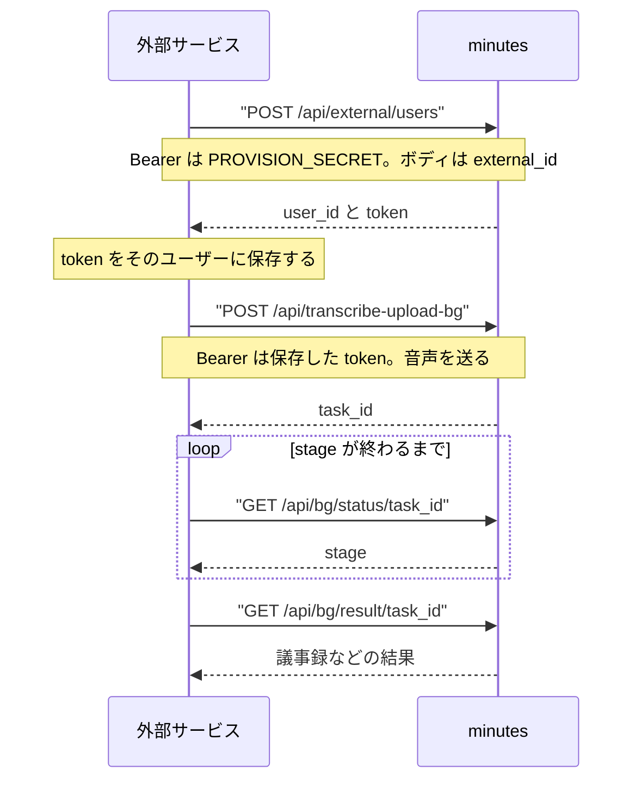
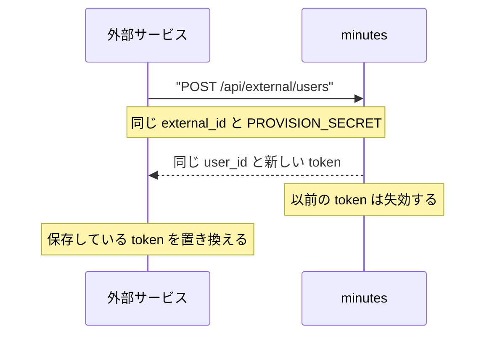

# 外部サービスからの利用

minutes のホストから、ベース URL と `PROVISION_SECRET` を受け取る。画面のログインと管理者 API は使わない。リクエストとレスポンスのフィールドの正本は [openapi.json](openapi.json) である。

Compose のベース URL は `http://<host>/api` である。80 番と `FRONTEND_PORT`（既定 8080）のどちらでも同じ nginx に届く。minutes の API コンテナはホストに公開されない。

## 接続の流れ



## ユーザーを発行する

`POST /api/external/users`

```http
Authorization: Bearer <PROVISION_SECRET>
Content-Type: application/json

{"external_id": "<自システムのユーザー id>"}
```

`external_id` は 1〜255 文字である。空白だけは拒否される。自システムでユーザーを一意に指す値をそのまま使う。

成功時の JSON は `user_id`、`token`、`token_id` である。平文の `token` はこの応答だけなので、自システムのユーザーに紐づけて保存する。同じ `external_id` は同じ minutes ユーザーになる。別の `external_id` は別のユーザーになり、そのユーザーの未削除タスクだけが見える。

発行用の秘密は、この発行口だけに付ける。利用者向けの API には付けない。ブラウザやフロントエンドのビルドにも入れない。minutes の管理者資格は渡されない。

## 録音から議事録まで

以降の呼び出しは `Authorization: Bearer <token>` を付ける。

1. `POST /api/transcribe-upload-bg` に音声を multipart の `file` で送る。受け付ける拡張子は `.wav`、`.mp3`、`.m4a`、`.flac`、`.ogg`、`.opus`、または `audio/` の Content-Type である。応答の `task_id` を保存する。
2. `GET /api/bg/status/{task_id}` を繰り返す。`stage` は `pending`、`preprocess`、`transcribing`、`formatting` を経て、`success`、`failed`、`cancelled` のいずれかで終わる。
3. `success` のあと、`GET /api/bg/result/{task_id}` で結果を取る。本文だけの取得は `GET /api/bg/minutes/{task_id}`、`GET /api/bg/transcript/{task_id}`、`GET /api/bg/summary/{task_id}`、`GET /api/bg/action-items/{task_id}` である。
4. 一覧は `GET /api/bg/tasks` である。

進捗の SSE（`GET /api/bg/events`）は、間に入るプロキシで切れることがある。状態は status のポーリングで見る。

## 取得したデータを表示する

### タスク一覧

`GET /api/bg/tasks` の応答は `{ "tasks": [...] }` である。各タスクの現在状態は `stage` で判定する。`preview_events` は新しい順の履歴が最大 3 件入るが、過去の `failure` を現在の失敗として扱わない。

| `stage` | 表示と処理 |
| --- | --- |
| `pending`、`preprocess`、`transcribing`、`formatting` | 処理中として表示する。必要なら `GET /api/bg/status/{task_id}` をポーリングする |
| `success` | 完了として表示し、選択時に結果を取得する |
| `failed` | 失敗として表示する。status または履歴の最新エラーを補足に使う |
| `cancelled` | キャンセル済みとして表示する |

一覧の `result` は処理途中のメタデータを含むことがある。`success` になるまで議事録として表示しない。

履歴に `failure: restarting interrupted task` があり、その後に `status: preprocess` などがあれば、停止していた処理を minutes が再投入した記録である。現在の `stage` が処理中なら、そのまま待つ。音声ファイルが失われた場合は `upload file is missing` で `failed` になる。

処理中の `stage` が長時間変わらない場合も、外部サービス側だけで `failed` に書き換えない。ポーリングを継続または中止する時間は呼び出し側で決め、minutes の状態確認は運用者へ委ねる。

### 結果詳細

`stage` が `success` のときに `GET /api/bg/result/{task_id}` を呼ぶ。成功時は次の形である。

```json
{
  "status": "success",
  "result": {
    "transcript": "...",
    "segments": [],
    "minutes": "...",
    "summary": "...",
    "action_items": []
  }
}
```

- `result.minutes` と `result.summary` は Markdown として描画する。raw HTML は実行しない。React では raw HTML を有効にしていない Markdown レンダラーを使う。
- `result.transcript` はプレーンテキストとして表示する。
- `result.segments` は区間ごとの時刻、文字列、話者名を使う画面だけで利用する。
- `result.action_items` は配列で、要素は `text`、または `who`、`what`、`due` などを持つ。未知のフィールドがあっても表示を壊さず、存在する値だけを使う。
- `minutes` が `[FALLBACK]` で始まる場合も API 上は成功である。ローカル整形の結果として表示し、必要なら「簡易整形」と注記する。

結果 API は未完了、失敗、キャンセルのタスクに HTTP 202 と `status`、`error` を返す。202 は成功レスポンスとして詳細画面へ渡さず、一覧の状態表示へ戻す。401 はトークンの再発行、404 は別ユーザーのタスクまたは存在しないタスクとして扱う。

## トークンをなくしたとき

同じ `external_id` で発行口をもう一度呼ぶ。`user_id` は変わらない。それまで有効だったサービストークンは失効し、新しい `token` が返る。保存している値をこのトークンに置き換える。



## 応答

発行口と利用者 API の失敗は `{ "error": "..." }` である。

| 状態 | 意味 |
| --- | --- |
| 404 `not found` | `PROVISION_SECRET` が未設定で、発行口が閉じている |
| 401 `invalid credentials` | 発行口に付けた秘密が一致しない |
| 401 `Not authenticated` | 利用者 API のトークンがない、未知、または失効している |
| 400 `invalid external_id` | `external_id` が空、空白のみ、または 256 文字以上 |
| 500 `request failed` | 発行の保存に失敗した。同じ `external_id` でやり直す |
